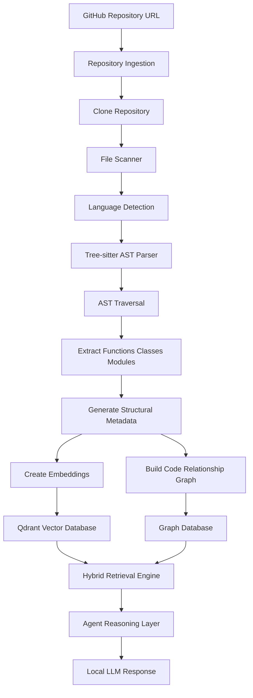

# Agent-PNSV

## AST-Driven Agentic GraphRAG for Repository-Level Code Understanding


---

## Overview

**Agent-PNSV** is an AST-driven Agentic GraphRAG system designed for deep understanding of large-scale software repositories.

Unlike traditional Retrieval-Augmented Generation (RAG) systems that treat source code as plain text, Agent-PNSV analyzes repositories using compiler-level structural information.

It combines:

* Abstract Syntax Tree (AST) parsing
* structural code chunking
* semantic vector retrieval
* relational graph traversal
* agent-based reasoning

to provide context-aware answers about complex codebases.

---

# Problem

Modern code repositories are not simple documents. They contain:

* function call relationships
* inheritance hierarchies
* module dependencies
* interfaces and implementations
* execution flows across multiple files

Traditional RAG systems struggle because they rely on text similarity.

### Limitations of Standard Code RAG

### 1. Incorrect Chunk Boundaries

Most RAG pipelines split files using fixed token or character windows.

Example:

```
function starts
        |
        |---- chunk boundary
        |
function continues
```

This can separate:

* function definitions from their logic
* classes from methods
* error handling blocks
* dependent code sections

---

### 2. Missing Code Relationships

Vector embeddings cannot naturally understand:

```
Controller
    |
    calls
    |
Service
    |
    depends on
    |
Database Layer
```

Important software relationships are lost.

---

### 3. Limited Repository-Level Reasoning

A developer question often requires multi-hop reasoning:

Example:

> "Where is user authentication handled?"

The answer may require:

```
API Route
    ↓
Controller
    ↓
Auth Service
    ↓
Database Model
    ↓
Configuration
```

Traditional retrieval cannot reliably reconstruct this path.

---

# Solution

Agent-PNSV converts repositories into a structured knowledge graph.

The system:

1. Parses source code into AST structures
2. Extracts meaningful code units
3. Builds relational edges between components
4. Performs hybrid semantic + graph retrieval
5. Uses local LLM inference for reasoning

---

# Architecture

```
Repository
     |
     v
+----------------------+
| Repository Ingestion |
+----------------------+
     |
     v
+----------------------+
| Tree-sitter AST      |
| Parser               |
+----------------------+
     |
     v
+----------------------+
| Structural Chunking  |
+----------------------+
     |
     +----------------+
     |                |
     v                v
Vector Store      Code Graph
(Qdrant)          (NetworkX/Neo4j)

     |                |
     +-------+--------+
             |
             v
      Agentic Retriever
             |
             v
       Local LLM
       (Ollama)
```

---

# System Workflow



---

# Core Components

## 1. AST-Based Structural Chunking

Agent-PNSV does not split code by characters.

Instead, Tree-sitter identifies real programming structures:

Supported nodes:

* functions
* classes
* methods
* structs
* imports
* modules

Each extracted unit contains:

```json
{
  "file": "auth/service.py",
  "type": "function",
  "name": "validate_user",
  "start_line": 45,
  "end_line": 92,
  "scope": "AuthService"
}
```

This ensures every retrieved context block is logically complete.

---

# 2. Repository Knowledge Graph

Extracted code units become graph nodes.

Relationships are represented as edges.

Supported relations:

## CALLS

Function execution relationships.

Example:

```
login()
  |
  calls
  |
validate_password()
```

---

## INHERITS_FROM

Class hierarchy mapping.

Example:

```
AdminUser
     |
     inherits
     |
User
```

---

## DEPENDS_ON

Module and import dependencies.

Example:

```
API Layer
    |
    depends on
    |
Database Layer
```

---

# 3. Hybrid Retrieval Engine

Agent-PNSV combines two retrieval strategies.

## Semantic Retrieval

Uses Qdrant vector search.

Purpose:

Find conceptually relevant code.

Example:

Query:

```
"Where is authentication implemented?"
```

Retrieves:

```
auth_controller.py
auth_service.py
middleware.py
```

---

## Graph Retrieval

After locating an entry point, the system traverses relationships.

Example:

```
AuthController

    |
    v

AuthService

    |
    v

UserRepository
```

This provides repository-level understanding.

---

# 4. Local AI Inference

Agent-PNSV uses local inference through Ollama.

Benefits:

* private source code
* no external API dependency
* suitable for enterprise repositories
* reproducible environments

Supported models:

* Llama
* DeepSeek
* other compatible Ollama models

---

# Technology Stack

| Layer               | Technology             |
| ------------------- | ---------------------- |
| Language            | Python 3.12            |
| Parsing             | Tree-sitter            |
| Embeddings          | Local embedding models |
| Vector Database     | Qdrant                 |
| Graph Engine        | NetworkX / Neo4j       |
| Agent Framework     | LangGraph              |
| API Layer           | FastAPI                |
| LLM Runtime         | Ollama                 |
| Repository Handling | GitPython              |

---

# Current Status

## Completed

* Repository ingestion pipeline
* Git cloning workflow
* File filtering system
* Tree-sitter language configuration
* Initial AST processing pipeline

## In Progress

* AST node extraction engine
* Code relationship extraction
* Graph construction layer
* Agentic retrieval pipeline

## Planned

* Multi-language expansion
* Advanced dependency analysis
* Repository visualization
* IDE integration
* Autonomous code navigation agent

---

# Future Vision

Agent-PNSV aims to provide an AI engineering assistant capable of understanding software repositories structurally rather than statistically.

The goal is to move from:

```
Search → Retrieve → Answer
```

towards:

```
Understand → Navigate → Reason → Explain
```

---

# License

MIT License

---

# Author

Built as an exploration into AST-aware AI systems, GraphRAG architectures, and intelligent developer tooling.
